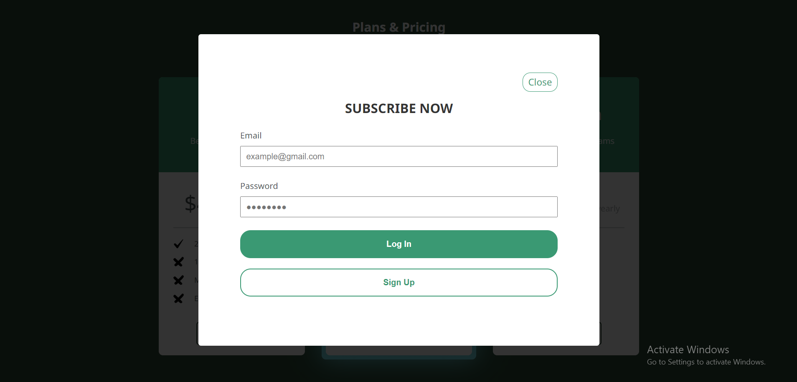

# Project Title: Pricing Table

## Demo
Check out the live demo of the MET Landing Page [here](https://pricing-table-kappa.vercel.app/).

## Description

This project is a modern and visually appealing pricing page that features three different subscription tiers: Basic, Standard, and Premium. 

Each subscription plan includes:
 - name
 - description
 - monthly and yearly pricing options
 - set of features. 
 
Users can easily switch between these tiers to compare the offerings.

The design of the page incorporates a contemporary style with visually engaging elements. The most popular subscription plan is visually highlighted to draw attention. Additionally, there are hover effects applied to each subscription plan and the "Get Started" button, enhancing the user experience.

Upon clicking the "Get Started" button, a popup window opens, providing users with a registration/login form, allowing them to take the next steps to access the services offered by each subscription tier.

## Responsivness

- On mobile, the table stacks the plan information vertically for easy
readability.
- On tablet, the table displays side by side for plans, and features should
remain readable.
- On desktop, the table has a comfortable width, and all information
should be presented neatly.

## Technologies Used
- HTML and SCSS: For styling and layout.
- JavaScript: For implementing interactivity and functionality.
- BEM (Block Element Modifier): For writing maintainable and scalable CSS code following the BEM methodology.

## Usage

To view the project, open the index.html file with your web browser.

## Screenshots

